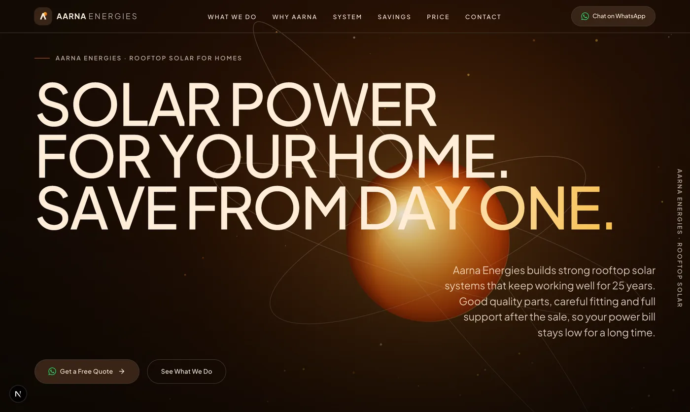
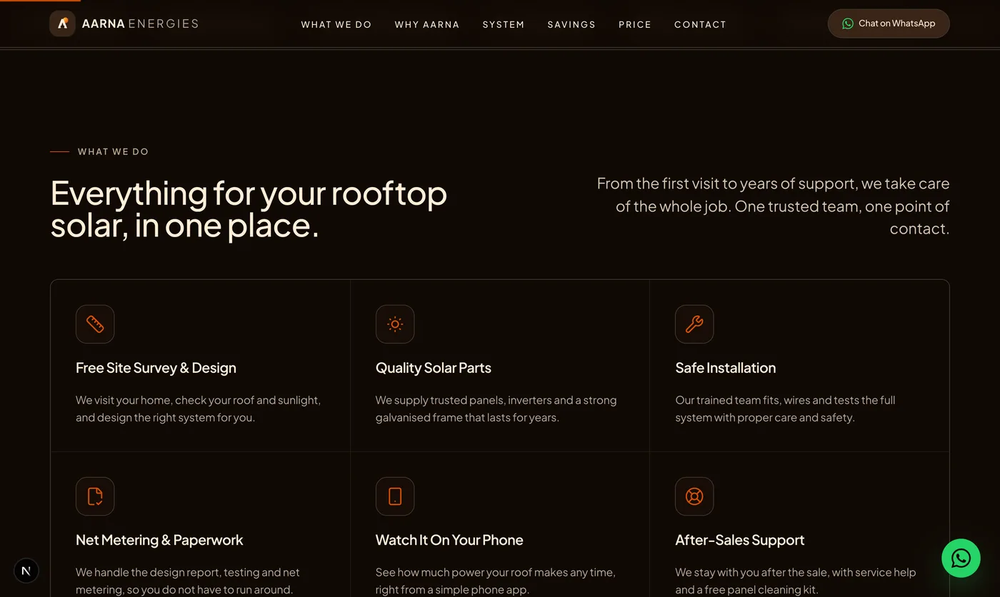
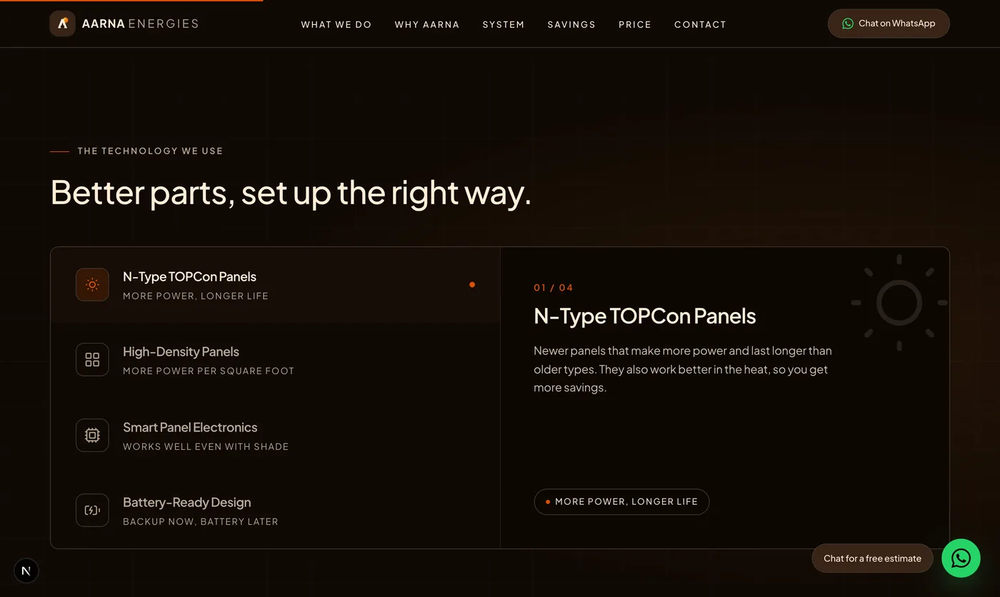
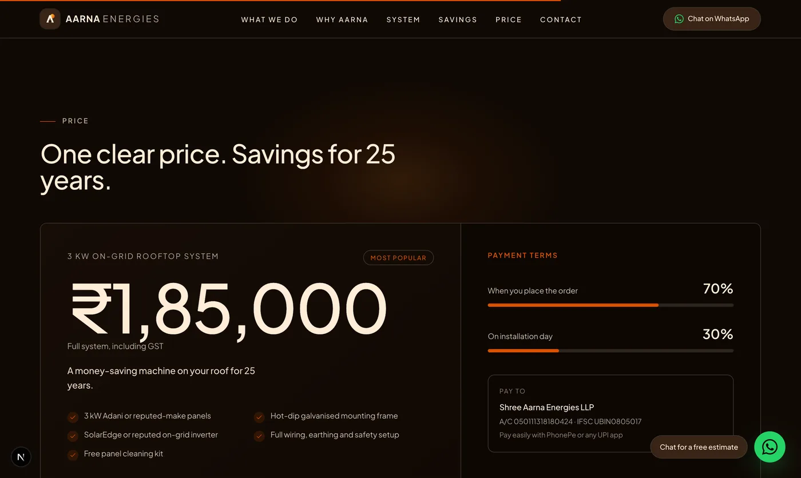
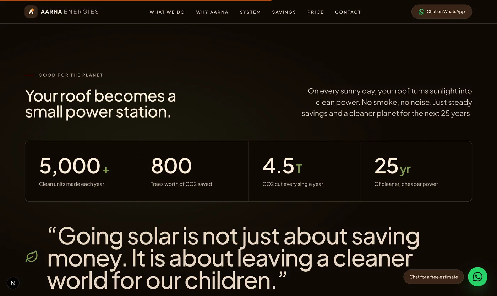
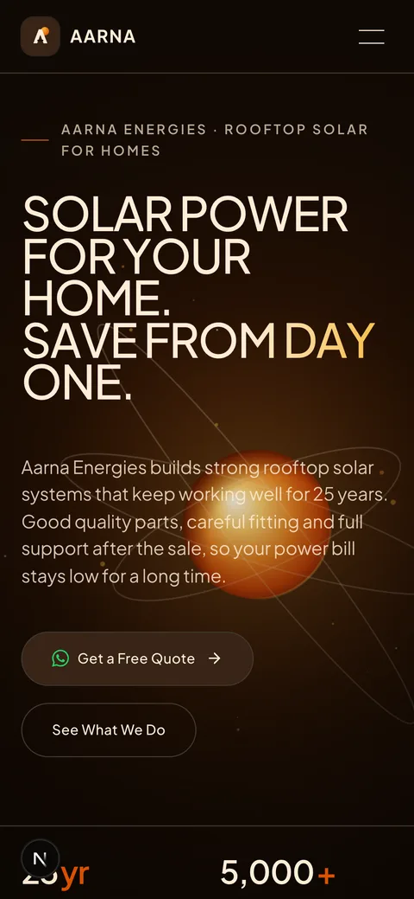
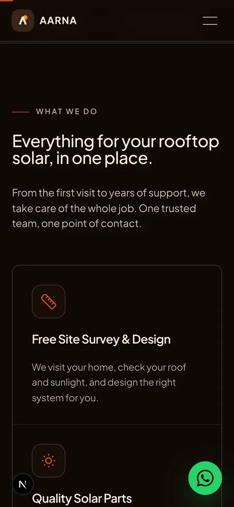
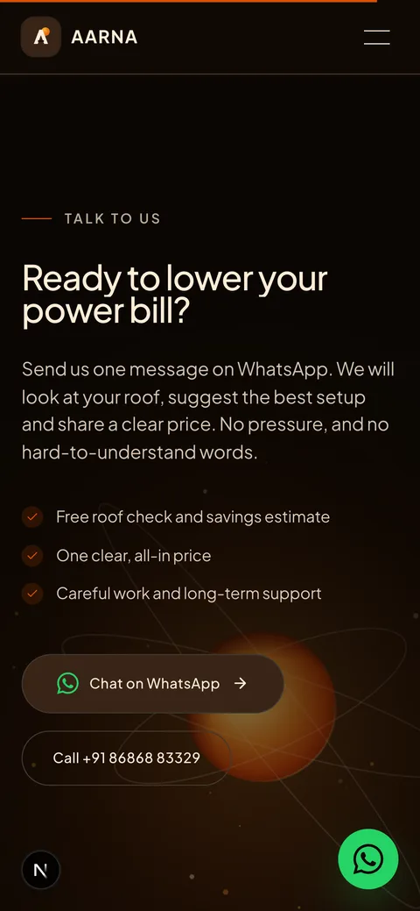

# Aarna Energies — Website

A modern, easy-to-read marketing website for **Aarna Energies** (Shree Aarna Energies LLP), a quality-first rooftop solar company. Its one job: help home owners understand rooftop solar in plain words and start a chat on **WhatsApp**.

> _"Solar is a 25-year asset for your home, not a quick electrical job."_




---

## ✨ Highlights

- **A live, futuristic solar core** — a hand-built HTML canvas renders a volumetric, 3D-shaded sun with tilted orbital rings, travelling energy nodes and a soft corona. It parallaxes gently toward the cursor.
- **WhatsApp-first lead capture** — every main button opens a ready-to-send WhatsApp Business chat. A floating chat bubble follows the visitor, and the pricing button even fills in the plan for them.
- **Simple, friendly English** — written for everyday readers (no jargon, no complex words), with large, easy-to-read text.
- **One-file content editing** — all copy, prices, specs, phone numbers and the WhatsApp number live in [`config/site.config.ts`](config/site.config.ts). No coding needed.
- **Clean line icons, no emojis** — consistent open-source icons throughout.
- **Installable (PWA)** — proper favicon plus Android/iOS home-screen app icons and a web manifest.
- **Fast & SEO-ready** — statically prerendered, with Open Graph tags, JSON-LD `LocalBusiness` data, `sitemap.xml` and `robots.txt`.
- **Fully responsive & accessible** — purpose-built desktop and mobile layouts, and it respects `prefers-reduced-motion`.

---

## 📸 A Look Around

### What We Do


### The Technology


### Price & Savings



### On Mobile

<table>
  <tr>
    <td width="33%"></td>
    <td width="33%"></td>
    <td width="33%"></td>
  </tr>
</table>

---

## 🧰 Tech Stack

| Layer         | Choice                                      |
| ------------- | ------------------------------------------- |
| Framework     | Next.js 16 (App Router, Turbopack)          |
| UI            | React 19 + TypeScript                       |
| Styling       | Tailwind CSS v4 (design tokens in CSS)      |
| Animation     | Motion (Framer Motion) 12                   |
| Smooth scroll | Lenis                                       |
| Icons         | lucide-react                                |
| Fonts         | Plus Jakarta Sans (variable, via next/font) |

---

## 🚀 Getting Started

```bash
# 1. Install dependencies
npm install

# 2. Run the dev server
npm run dev
# → http://localhost:3000

# 3. Build for production
npm run build && npm run start
```

Requires **Node.js 18.18+** (Node 20+ recommended).

### Handy scripts

| Command          | What it does                                              |
| ---------------- | -------------------------------------------------------- |
| `npm run dev`    | Start the local dev server                               |
| `npm run build`  | Production build                                         |
| `npm run icons`  | Regenerate favicon + app icons from the brand mark       |
| `npm run shots`  | Capture the screenshots in this README (server must run) |

---

## ✏️ Editing the Content (start here)

**You almost never need to touch the code.** Everything visible on the site is in one file:

```
config/site.config.ts
```

Open it, change the text between the quotes, save. A few common edits:

### Change the WhatsApp number (most important)

```ts
contact: {
  whatsapp: "918686883329",   // ← international format, no "+" or spaces
  whatsappDefaultMessage: "Hi Aarna Energies, I want a free rooftop solar quote...",
}
```

Every "Chat on WhatsApp" button, the floating bubble and the contact section all use this number automatically.

### Change the price

```ts
pricing: {
  plan: {
    price: "₹1,85,000",
    priceNote: "Full system, including GST",
    includes: [ "3 kW Adani or reputed-make panels", /* ... */ ],
  },
}
```

### Edit the services, technology, specs or FAQ

Each section is numbered and commented in the config. Lists are just items separated by commas — add or remove freely. For services and technology, the `icon` value is a friendly name from a fixed set (see [`components/ui/iconMap.tsx`](components/ui/iconMap.tsx)).

> 💡 Tip: keep the quotes `" "` around text and the commas at the end of each line.

---

## 🗂️ Project Structure

```
aarna-energies/
├── app/
│   ├── layout.tsx          # Root layout, fonts, SEO + icon metadata
│   ├── page.tsx            # Assembles all sections + JSON-LD
│   ├── globals.css         # Design tokens (Tailwind v4 @theme) + base styles
│   ├── manifest.ts         # PWA web manifest
│   ├── sitemap.ts          # /sitemap.xml
│   └── robots.ts           # /robots.txt
├── components/
│   ├── sections/           # One file per page section (Hero, WhatWeDo, …)
│   └── ui/                 # Reusable parts (Button, Counter, SunField, …)
├── config/
│   └── site.config.ts      # ⭐ ALL editable content
├── lib/                    # WhatsApp link builder + helpers
├── scripts/                # Icon + screenshot generators
└── public/                 # Favicon + generated app icons
```

### Page sections (top → bottom)

Hero → Marquee → What We Do → Our Promise → Why Aarna → Technology → Inverter Comparison → System → Savings/Impact → Who Does What → Price → Partners → FAQ → Contact → Footer.

---

## 🎨 Design System

A warm, dark "engineered light" look. Tokens live once in `app/globals.css` under Tailwind's `@theme`:

| Token         | Value     | Role                                |
| ------------- | --------- | ----------------------------------- |
| `canvas`      | `#100904` | Warm near-black page background      |
| `cream`       | `#ffedd7` | Primary text and borders            |
| `sienna`      | `#dc5000` | Burnt-sienna accent                 |
| `solar-amber` | `#e8801f` | The animated sun glow               |
| `forest`      | `#7c9a4e` | Green "savings / planet" accent     |

Type uses **Plus Jakarta Sans** across every size, from small labels to large display headlines.

---

## ☁️ Deployment

A standard Next.js app — deploy anywhere that supports Next 16. The easiest is **Vercel**:

1. Push to GitHub (already configured).
2. Import the repo at [vercel.com/new](https://vercel.com/new).
3. Deploy — no environment variables required.

After deploying, update `meta.url` in `config/site.config.ts` to your live domain so the SEO tags and sitemap are correct.

---

## 📞 Company

**Shree Aarna Energies LLP** · GST 37AFPFS4704M1ZC
Vizianagaram, Andhra Pradesh, India
📱 +91 86868 83329 · ✉️ sriaarnaenergies@gmail.com

Trusted partner of **SolarEdge** and **S R Portables**.

---

_Built with care. Powered by good choices and bright sunshine._
